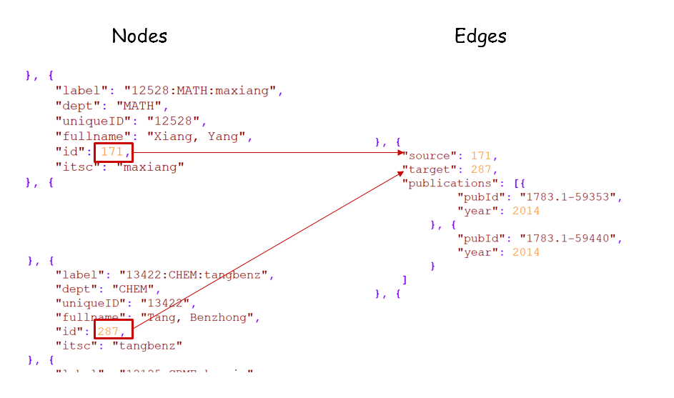
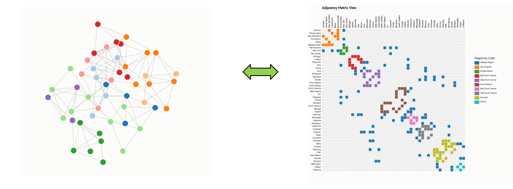

# Level 3 challenge: Linkage between multiple view

This task focuses on visualizing the collaboration relationship between researchers. A JSON format data containing the collaboration records among professors in HKUST is provided. You can find the data in [HKUST_coauthor_graph.json](./HKUST_coauthor_graph.json). It consists of two parts: nodes and edges. The nodes represent professors and the edges are their corresponding collaborations (See the following figure).

  

You need to extract the subgraph of **CSE** (i.e., extract the collaboration subgraph consisting of all the professors from **CSE**), and visualize them in two forms: a node-link diagram and a matrix view.

Here are the basic requirements:

1. For the node-link diagram, the nodes indicate professors and the edges indicate collaborations. You are encouraged to use the force-directed layout provided by D3. The radii of nodes represent the total number of collaborators of each professor.

1. For the matrix view, the x and y direction indicate professors, and cells indicate the corresponding collaborations. You can use color or glyph to encode the total number of collaborations.

1. Linkage: when hovering the mouse on node in the node-link diagram, the corresponding column and row of the matrix view should be highlighted; when hovering on a cell in the matrix view, the corresponding nodes and edges should be highlighted as well.

1. You are encouraged to sort the matrix rows and columns and add animations to your implementation.

  An example is like this:

  
