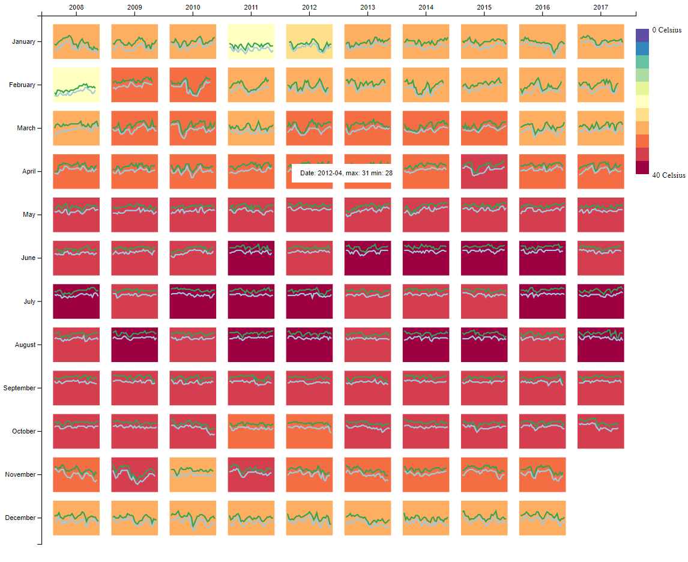

# Level 1 challenge: Year/Month Heatmap
In this Task, you need to draw a **Matrix View** to visualize the **Monthly Temperature** of HK, where the color of each matrix cell encodes the temperature. You can find the data in [temperature_daily.csv](./temperature_daily.csv)

Here are the basic requirements:

1. In the matrix, x direction indicates the year and y direction indicates the month (you can switch them if you like). Each cell indicates the corresponding month of a specific year. The axis should be drawn here.

1. You need to visualize the maximum temperature and minimum temperature by month in some way (e.g. you can use click to switch max or min temperature).

1. When hovering mouse on each cell, a tip should appear to show the time and temperature value.

1. A legend is needed to show the mapping between color and value.

  An example is like this:

  

# Level 2 Challenge: Improvement of the Year/Month Heatmap

In Task 1, we are able to visualize the temperature differences across months of each year. However, even within one month, the temperature may also vary drastically. In this task, you need to improve the previous visualization by showing the daily changes of the temperature. You only need to focus on the last 5 to 10 years in the data.

1. In the matrix, x direction indicates the year and y direction indicates the month (you can switch them if you like). Each cell indicates the corresponding month of a specific year. The axis is needed to show the time.

1. In each cell, you need to visualize the daily change of the maximum temperature and minimum temperature. You can use Linechart or Stacked Barchart, the x direction presents the days in a month, and y direction present the temperature.

1. A legend is needed to show the mapping between color and value.

# Submission:

Please create a github repository under your github account, and send us the link.
