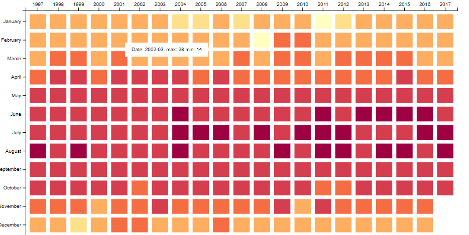

# HKUST VisLab Coding Challenge

Welcome to the coding challenge of VisLab! We have set a couple of challenges for you:

## Level 1 & 2 (Basic): [Link](./level1.md)
HK Temperature Heatmap

## Level 3 (Intermediate): [Link](./level3.md)
HKUST Co-author Graph

## Level 4 and above (Optional)

The followings challenges will take more time to complete and include an open-end bonus part.

Please take only **ONE** challenge at maximum.

### Level 4 (Data Analysis): [Link](./level4.md)
Spotify's Worldwide Daily Song Ranking

### Level 5 (Machine Learning specific): [Link](./level5.md)
Kaggle competition: Dogs vs. Cats

### Level 6 (Fullstack Web Application): [Link](./level6.md)
Stock Market Chart

## Grading:
1. Correctness (50%)
2. Maintainability (50%)

## Submission:

Please create a github repository under your github account, and send us the URL of that repository.

Happy coding!
